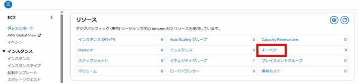
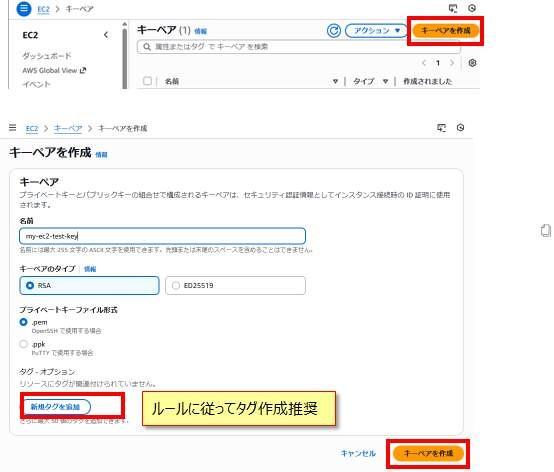

<!-- 共通CSS・JS読み込み -->
<!-- <link rel="stylesheet" href="../assets/css/style.css"> -->
<script src="../assets/js/command-generator.js"></script>

# キーペア作成

EC2インスタンスにSSH接続するためにキーペア(.pemファイル)の作成が必要です。

<details markdown="1" class="toc-collapse">
<summary>📑 目次</summary>

{: .no_toc }

1. TOC
{:toc}

</details>

---

## 概要

- EC2インスタンスにSSH接続するためにキーペア(.pemファイル)の作成が必要
- キーペアは自分用に一つ作ってしまえば、EC2接続する際に使い回しができる
- **AWSコンソール**、または、**コマンドライン(VSCode使用)** のどちらかで作成

---

## 方法1: AWSコンソールで作成

### 1. AWSコンソールにログインする

[AWS マネジメントコンソール](https://console.aws.amazon.com/)にアクセスしてログイン

### 2. EC2のキーペアを開く

1. サービスから「EC2」を選択
2. 左メニュー「ネットワーク＆セキュリティ」→「キーペア」



### 3. キーペアを作成

1. **「キーペアを作成」**ボタンをクリック
2. 以下を入力：
   - **名前**: `my-ec2-test-key`（任意の名前）
   - **キーペアのタイプ**: RSA
   - **プライベートキーファイル形式**: .pem
3. **「キーペアを作成」**ボタンをクリック



### 4. キーファイルをダウンロード

- `.pem`ファイルが自動でダウンロードされます
- **任意の場所に保存**（例: `C:\my-aws\aws-learning-projects\ec2-cloudformation\`）
- **このファイルは再ダウンロードできません** - 大切に保管してください

> **💡 注意**  
> ローカルPCからAWS上のEC2に接続する際に使用します

---

## 方法2: コマンドラインで作成（VSCode使用）

### 1. VSCodeのターミナルを開く

- **Ctrl + J** でターミナルを開く

### 2. キーペアを作成するフォルダに移動
```batch
cd "C:\my-aws\aws-learning-projects\ec2-cloudformation"
```

> **💡 ヒント**  
> フォルダパスは各自の環境に合わせて変更してください

### 3. コマンド入力でキーペアを作成
```batch
aws ec2 create-key-pair --key-name my-ec2-test-key --query 'KeyMaterial' --output text --region ap-northeast-1 > my-ec2-test-key.pem
```
{: .wrap-code}

**パラメータ説明**:
- `--key-name`: キーペアの名前
- `--region`: リージョン（東京の場合は `ap-northeast-1`）
- `> my-ec2-test-key.pem`: 出力をファイルに保存

### 4. AWSコンソールでキーペアが作成されたことを確認

AWSコンソール → EC2 → キーペア で作成されたキーペアを確認

### 5. キーペアファイルが作成されたかを確認
```batch
dir my-ec2-test-key.pem
```

ファイルが表示されればOK

---

## EC2インスタンスに接続する場合（Windows環境）

### SSH接続時の権限エラーについて

Windows上のVSCodeターミナル（cmdおよびPowerShell）でEC2インスタンスにSSH接続すると、以下のようなエラーが発生する場合があります：
```
Permissions for 'my-ec2-test-key.pem' are too open.
It is required that your private key files are NOT accessible by others.
```

> **💡 注意**  
> **Git Bash**は内部でLinux風の権限処理をするためエラーにならずに接続可能です

### 解決方法: GUIで権限を修正

下記の手順に沿ってキーペアファイルの権限を変更します。

#### 手順1: プロパティを開く

`.pemファイル`を右クリック → **プロパティ** → **セキュリティ** → **詳細設定**

#### 手順2: 継承の無効化

1. **「継承の無効化」**ボタンをクリック
2. **「このオブジェクトから継承されたアクセス許可をすべて削除します」**を選択

#### 手順3: プリンシパルの選択

1. **「追加」**ボタンをクリック
2. **「プリンシパルの選択」**をクリック
3. 自分のWindowsユーザー名を入力
4. **「名前の確認」**→ **「OK」**

#### 手順4: フルコントロールにチェック

1. **「フルコントロール」**にチェック
2. **「OK」**で閉じる

#### 手順5: 他のユーザー/グループを削除

継承を無効化すると他のユーザー（Administratorsなど）も表示される場合があります。  
自分以外のすべてのエントリを削除してください。

### EC2インスタンスにSSH接続

権限設定後、以下のコマンドで接続：
```batch
ssh -i my-ec2-test-key.pem ec2-user@<EC2のパブリックIP>
```

**接続成功！！**

---

## PowerShellコマンドで権限を修正（代替方法）

GUIではなくPowerShellコマンドで権限を設定することも可能です：
```powershell
# 継承を無効化し、既存のアクセス許可を削除
icacls.exe my-ec2-test-key.pem /reset

# 現在のユーザーにのみフルコントロールを付与
icacls.exe my-ec2-test-key.pem /grant:r "$($env:USERNAME):(F)"

# 他のすべてのユーザーのアクセスを削除
icacls.exe my-ec2-test-key.pem /inheritance:r
```

---

## まとめ

- キーペアは**AWSコンソール**または**コマンドライン**で作成可能
- 一度作成すれば複数のEC2インスタンスで使い回せる
- Windows環境では**権限設定**が必要
- **Git Bash**を使えば権限エラーを回避可能

[← トップページに戻る](../index.md) | [次へ: CloudFormationで構築 →](cloudformation.md)